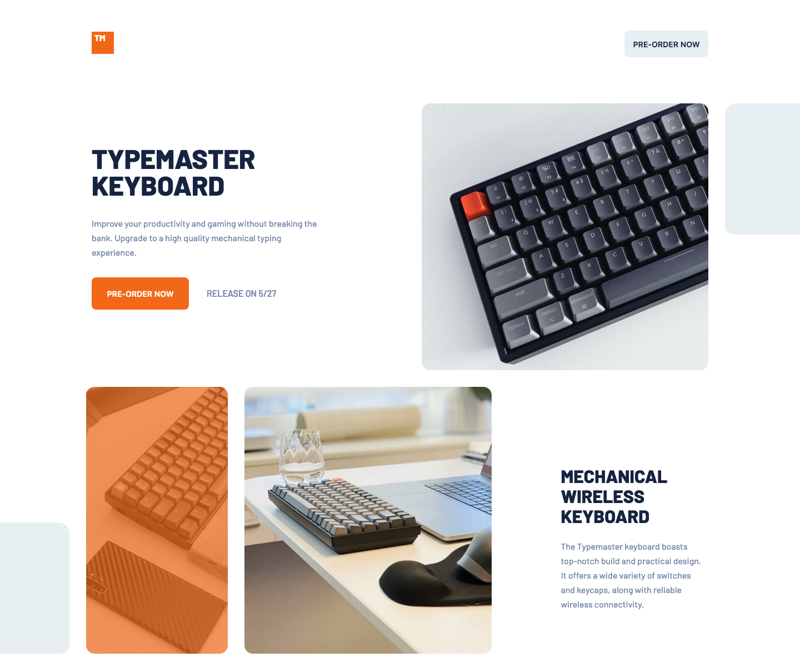

# Frontend Mentor - Typemaster Pre Launch challenge on Frontend Mentor

This is a solution to the [Typemaster Pre Launch challenge on Frontend Mentor](https://www.frontendmentor.io/challenges/four-card-feature-section-weK1eFYK). Frontend Mentor challenges help you improve your coding skills by building realistic projects. 

## Table of contents

- [Overview](#overview)
  - [The challenge](#the-challenge)
  - [Screenshot](#screenshot)
  - [Links](#links)
- [My process](#my-process)
  - [Built with](#built-with)
  - [What I learned](#what-i-learned)
  - [Continued development](#continued-development)
- [Author](#author)

## Overview

This is the first project where i'm using sass css preprocessor, i'm sure it could have been done (a bit) more efficient. I'm still learning and happy with the result so far. 

### The challenge

Coding Time : too much (scared to lookup stats)

Users should be able to:

- View the optimal layout for the site depending on their device's screen size.

### Screenshot



### Links

- Solution URL: [GitHub](https://github.com/Drallas/Typemaster-Pre-Launch-Landing-Page/)
- Live Site URL: [GitHub Pages](https://drallas.github.io/Typemaster-Pre-Launch-Landing-Page/)

## My process

### Built with

- Semantic HTML5 markup
- CSS / SASS / BEM

### What I learned

- Preparing the build and drawing up a small plan of attack is very helpful building a frondend design.
- Starting with the mobile and making sure it's good; before continuing with the other layouts is an efficient workflow.
- SASS is usefull but it requires some time to get used to it and even more to utilise most of the features.

Receiving feedback I learned that SASS @import is depreciated and @use should be used. I managed to make he switch; updating to a mainted SASS Compiler for VSCode and rafactoring the code to use @use.  

The Orange background overlay blend initiall was a bit off, found out that ```background-blend-mode``` should be used instea of a linear gradient. 

```css
background-image: url(../../assets/mobile/image-phone-and-keyboard.jpg);
background-color: hsla(22, 89%, 52%, 1);
background-blend-mode: multiply ;
```

Happy I could refactor the code and make the solution more solid!

### Continued development

My development is best served by building more projects like this, collect feedback and refine. For now i want to improve CSS / BEM / SASS and make sure that i keep on learning this craft. My focus areas are responsive layout and avoiding too much exact element properties. 

## Author

- Frontend Mentor - [@Drallas](https://www.frontendmentor.io/profile/Drallas)
- Dev.to - [@Drallas](https://dev.to/drallas)


