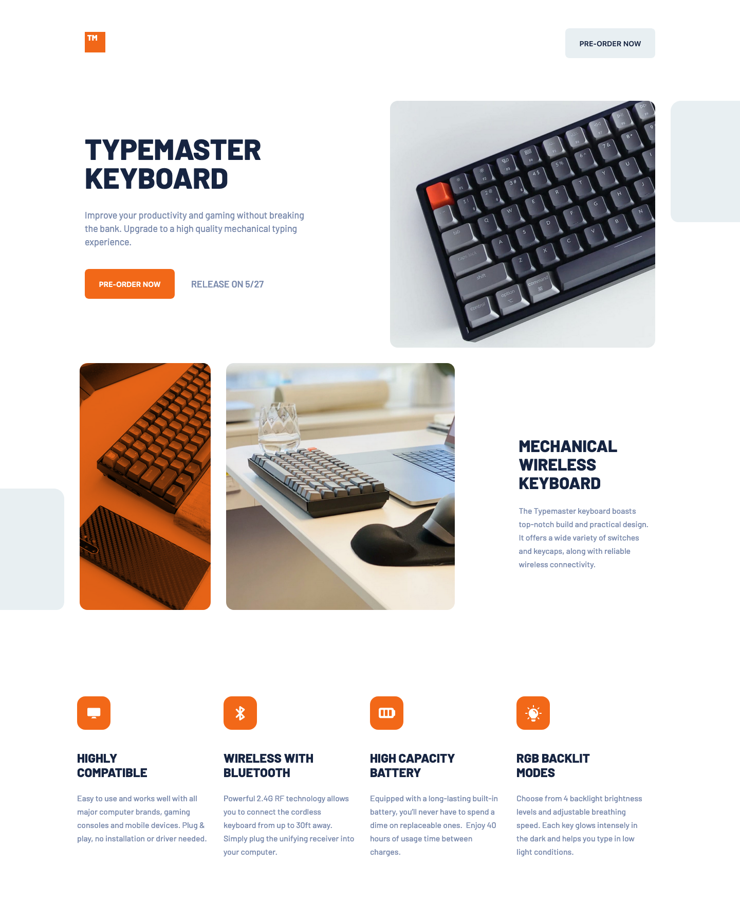

# Frontend Mentor - Four card feature section solution

This is a solution to the [Typemaster Pre Launch challenge on Frontend Mentor](https://www.frontendmentor.io/challenges/four-card-feature-section-weK1eFYK). Frontend Mentor challenges help you improve your coding skills by building realistic projects. 

## Table of contents

- [Overview](#overview)
  - [The challenge](#the-challenge)
  - [Screenshot](#screenshot)
  - [Links](#links)
- [My process](#my-process)
  - [Built with](#built-with)
  - [What I learned](#what-i-learned)
  - [Continued development](#continued-development)
  - [Useful resources](#useful-resources)
- [Author](#author)

## Overview

This is the first project where i'm using sass ass css preprocessor, i'm sure it could have been done a bit more efficient. I'm still learning and happy 

### The challenge

Users should be able to:

- View the optimal layout for the site depending on their device's screen size.

### Screenshot



### Links

- Solution URL: [GitHub](https://github.com/Drallas/Typemaster-Pre-Launch-Landing-Page/)
- Live Site URL: [GitHub Pages](https://drallas.github.io/Typemaster-Pre-Launch-Landing-Page/)

## My process

### Built with

- Semantic HTML5 markup
- CSS / SASS / BEM

### What I learned

Use this section to recap over some of your major learnings while working through this project. Writing these out and providing code samples of areas you want to highlight is a great way to reinforce your own knowledge.

To see how you can add code snippets, see below:

```html
<h1>Some HTML code I'm proud of</h1>
```
### Continued development

Use this section to outline areas that you want to continue focusing on in future projects. These could be concepts you're still not completely comfortable with or techniques you found useful that you want to refine and perfect.

### Useful resources

- [Example resource 1](https://www.example.com) - This helped me for XYZ reason. I really liked this pattern and will use it going forward.

## Author

- Frontend Mentor - [@Drallas](https://www.frontendmentor.io/profile/Drallas)
- Dev.to - [@Drallas](https://dev.to/drallas)


